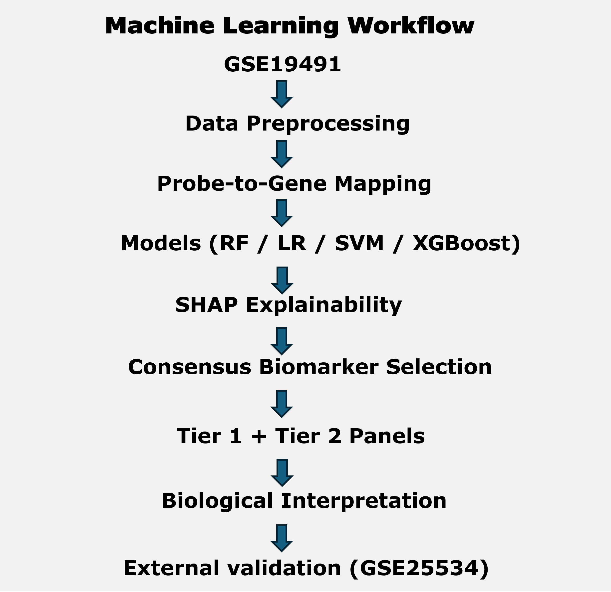

<p align="center">
  
</p>


## Project Overview

This repository accompanies our research on machine learning–driven discovery of blood-based transcriptional biomarkers for tuberculosis (TB) using publicly available human gene expression datasets.

The project integrates Random Forest, Logistic Regression, Support Vector Machine, XGBoost, SHAP explainability, consensus biomarker prioritization, biological interpretation, and external validation planning into a single reproducible workflow.

Beyond predictive performance, the study emphasizes biological interpretability, identifying host-response signatures that are statistically robust, biologically meaningful, and potentially translatable into future diagnostic applications.

This repository provides the complete collection of project resources, including the manuscript, scientific poster, interactive Tableau dashboard, workflow documentation, figures, tables, and reproducibility materials.

---

## Companion to the Manuscript

This repository serves as the official public companion to the manuscript:

Machine Learning–Driven Biomarker Discovery for Tuberculosis Using Human Transcriptomic Data

The repository extends the manuscript by providing materials that cannot easily be presented within a traditional journal article, including:

* Interactive Tableau dashboard
* Scientific poster
* High-resolution workflow diagrams
* Complete figures
* Supporting tables
* Biological interpretation summaries
* Reproducibility documentation
* Project evolution and future work

Together, the manuscript and this repository provide a comprehensive, transparent, and reproducible record of the project.

## Project Resources

| Resource | Description | Location |
|----------|-------------|----------|
| 📄 **Disease** | Complete scientific manuscript | `/reports/` |
| 📊 **Interactive Dashboard** | Interactive Tableau visualization | Tableau Public |
| 🖼️ **Scientific Poster** | Conference-style project summary | `/reports/poster/` |
| 📈 **Figures** | Publication-quality graphics | `/results/figures/` |
| 📋 **Tables** | Performance metrics and biomarker tables | `/results/tables/` |
| 🔬 **Workflow** | End-to-end analytical workflow | `/docs/workflow.md` |
| 📁 **Reproducibility Resources** | Project documentation and supporting materials | Repository root |

## Results at a Glance

| Category | Outcome |
|----------|-------------|
| **Manuscript** | Human Tuberculosis (TB). |
| **Training Dataset** | GEO GSE19491. |
| **External Validation** | GEO GSE25534. |
| **Machine Learning Models** | Random Forest, Logistic Regression, Linear SVM, XGBoost.|
| **Explanability** | SHAP feature importance. |
| **Feature Selection** | Consensus multi-model biomarker prioritization. |
| **Biological Context** | Single-cell mapping and systems immunology. |
| **Deliverables** | Manuscript, dashboard, poster, workflow, reproducibility resources. |

## Performance Table

| Model | ROC-AUC | Mean Cross-Validation AUC |
|----------|-------------|----------|
| **Random Forest** | 0.793 |0.921  |
| **Logistic Regression** | 0.806 |0.943  |
| **Linear SVM** | 0.840 |0.955  |
| **XGBoost** | 0.923 |**Pending**  |

Consensus biomarkers were prioritized using agreement across multiple machine learning models together with SHAP explainability, resulting in biologically interpretable candidate signatures for tuberculosis diagnosis.

## Key Contributios

- Integrated four complementary machine learning algorithms for biomarker discovery.

- Prioritized biomarkers using consensus feature selection together with SHAP explainability.

- Combined transcriptomics with systems immunology for biological interpretation.

- Established an external validation framework using an independent GEO cohort.

- Developed a complete companion research repository supporting transparency and reproducibility.

## Scientific Motivation

Tuberculosis remains one of the leading infectious causes of death worldwide. Early and accurate diagnosis is essential for disease control, yet conventional diagnostic approaches may be limited by sensitivity, infrastructure requirements, or turnaround time.

Host transcriptomic biomarkers provide an opportunity to identify disease-associated immune signatures directly from patient gene expression profiles. However, many machine learning studies emphasize predictive performance without sufficient biological interpretation or validation.

This project addresses that gap by integrating:

* Machine learning classification
* Consensus biomarker prioritization
* SHAP explainability
* Biological interpretation
* External validation planning

to identify biomarker candidates that are both statistically robust and biologically meaningful.

---

## Objectives

The primary objectives of this project were to:

1. Develop machine learning models capable of distinguishing Active TB from Healthy Controls.
2. Identify candidate biomarkers using multiple feature selection approaches.
3. Evaluate model interpretability using SHAP explainability analysis.
4. Prioritize biologically relevant biomarker panels.
5. Assess biomarker robustness through consensus evaluation.
6. Establish an external validation workflow for independent dataset assessment.

---

## Dataset Description

### Discovery Dataset

**GSE19491**

* Platform: Illumina HumanHT-12 v3.0 Expression BeadChip
* Organism: Human
* Phenotypes:

  * Active Tuberculosis
  * Latent Tuberculosis
  * Healthy Controls

For Phase 1 analyses, the primary classification task focused on:

**Active TB vs Healthy Controls**

### External Validation Dataset

**GSE25534**

Used as an independent cohort for feature alignment, biomarker reproducibility assessment, and future model generalizability evaluation.

---

## Interactive Dashboard

An interactive Tableau dashboard summarizing machine learning performance, biomarker prioritization, explainability analyses, and project outcomes is available through Tableau Public.

**View Dashboard:**
[Biomedical ML for TB Biomarker Discovery Dashboard](https://public.tableau.com/app/profile/abdulrahman.hammond/viz/ML-TB_project_dashboard_ver3_ash22Jun2026/Dashboard1)

The dashboard provides an accessible summary of model performance, biomarker selection, explainability results, and external validation activities. It complements the repository by allowing users to interactively explore key findings and project outputs.


## Machine Learning Workflow



*Figure 0. End-to-end machine learning workflow used for tuberculosis biomarker discovery and biological interpretation.*
## Key Results

### Baseline Model Performance

| Model               | Accuracy | Precision | Recall | ROC-AUC |
| ------------------- | -------- | --------- | ------ | ------- |
| Logistic Regression | 0.89     | 0.89      | 0.97   | 0.806   |
| Random Forest       | 0.87     | 0.87      | 0.97   | 0.793   |
| SVM                 | NA       | NA        | 1.00   | 0.840   |
| XGBoost             | NA       | NA        | NA     | 0.923   |

### Major Findings

* All baseline models demonstrated strong discrimination between Active TB and Healthy Controls.
* Logistic Regression achieved the highest overall accuracy (0.89).
* SVM achieved the strongest cross-validation performance (Mean CV AUC = 0.955).
* XGBoost achieved the highest test ROC-AUC (0.923).
* Multiple models independently identified overlapping biomarker candidates, supporting biomarker robustness.

---

## Scientific Poster

A conference-style scientific poster summarizing the project's objectives, methodology, machine learning workflow, biomarker discovery, and biological interpretation is available below.

### Poster Preview


**Download high-resolution PDF:**

[TB Biomarker Discovery Poster (PDF)](reports/TB_Biomarker_Discovery_Poster.pdf)

The poster provides a concise visual summary of the complete biomarker discovery pipeline and complements the detailed documentation contained throughout this repository.


## Consensus Biomarker Panel

### Tier 2 – Biologically Prioritized Biomarkers

| Gene   | Biological Role                    |
| ------ | ---------------------------------- |
| GBP1P1 | Interferon-stimulated response     |
| NSMAF  | TNF / immune stress signaling      |
| OSM    | Inflammatory cytokine signaling    |
| PARP14 | Immune regulation / STAT signaling |
| STAT1  | Interferon signaling               |

### Tier 1 – Multi-Model Consensus Biomarkers

* CLEC4GP1
* CPN2
* DOC2B
* F7
* KNSTRN
* PDE4DIP
* RNA28S5

### Combined Reduced Panel

The final reduced biomarker panel consisted of 12 candidate genes combining consensus machine learning support and biological relevance.

---

## Biological Insights

Biological interpretation revealed strong enrichment for:

* Interferon-mediated immune responses
* TNF-associated inflammatory signaling
* Cytokine-mediated immune regulation
* Host-defense and antimicrobial pathways

STAT1 emerged as a particularly compelling biomarker due to its central role in interferon-responsive transcriptional programs. Additional candidates including GBP1P1, PARP14, NSMAF, and OSM demonstrated convergence of machine learning support, SHAP importance, and biological plausibility.

Together, these findings suggest that active tuberculosis is characterized by coordinated activation of interferon and inflammatory signaling pathways that can be detected through host transcriptional signatures.

---

## Explainability Analysis

Model interpretability was assessed using SHAP (SHapley Additive exPlanations).

SHAP analysis identified multiple immune-associated genes among the strongest contributors to model predictions and provided quantitative evidence supporting biomarker prioritization.

### ROC Curve Comparison


*Figure 1. Receiver Operating Characteristic (ROC) curve comparison of Random Forest (RF), Logistic Regression (LR), and Support Vector Machine (SVM) models for Active TB versus Healthy Control classification. All models demonstrated strong discriminatory performance, with SVM achieving the highest ROC-AUC.*

### SHAP Summary Plot


*Figure 3. SHAP summary plot showing gene-level contributions to Active TB versus Healthy Control classification. STAT1, GBP1P1, PARP14, NSMAF, and other immune-associated genes contributed strongly to model predictions.*

Additional visualizations are available in:

- [Figure 2: Cross-Validation Comparison](results/figures/Figure_2_CrossValidationComparison.png)

*Figure 2. Stratified 5-fold cross-validation performance across machine learning models. SVM demonstrated the strongest mean validation performance, supporting model robustness and generalizability.*

- [Figure 4: SHAP Feature Importance Plot](results/figures/Figure_4_SHAP_Barplot.png)

*Figure 4. SHAP feature importance ranking of candidate biomarkers. Genes with larger mean absolute SHAP values exerted greater influence on model predictions and were prioritized for downstream biological interpretation.*

## External Validation

Independent validation was initiated using GSE25534.

Completed activities include:

* External dataset selection
* Phenotype label generation
* External biomarker panel creation
* Feature alignment
* Platform compatibility verification

Final validation modeling and performance metrics remain pending reconstruction following notebook loss caused by a power interruption. The validation workflow will be rerun to restore quantitative performance estimates and complete the model generalizability assessment.

---

## Supporting Tables

The project generated multiple structured result tables summarizing model performance,
biomarker prioritization, explainability analysis, robustness assessment, biological
interpretation, and external validation workflow status.

The tables below provide direct access to the primary quantitative outputs of the study.
...
| Table                                                                                         | Description                                                                                  |
| --------------------------------------------------------------------------------------------- | -------------------------------------------------------------------------------------------- |
| [Table A – Baseline Model Performance](results/tables/Table_A_Phase_1_BaselinePerformance.jpg) | Classification performance metrics for Logistic Regression, Random Forest, SVM, and XGBoost. |
| [Table B – Consensus Biomarker Panels](results/tables/Table_B_Phase_1_TierPanels.jpg)          | Tier 1 and Tier 2 biomarker candidates identified through multi-model consensus.             |
| [Table C – Robustness Assessment](results/tables/Table_C_Phase_1_RobustnessAssessment.jpg)     | Cross-model support and robustness evaluation of candidate biomarkers.                       |
| [Table D – External Validation Workflow](results/tables/Table_D_ExternalValidation.jpg)       | Status of external validation activities using GSE25534.                                     |
| [Table E – SHAP Top Features](results/tables/Table_E_SHAP_TopFeatures.jpg)                    | Highest-ranked biomarkers identified through SHAP explainability analysis.                   |
| [Table F – Biological Interpretation](results/tables/Table_F_BiologicalInterpretation.jpg)    | Functional categorization and biological roles of prioritized biomarker candidates.          |

## Key Repository Documents

The following documents provide detailed information about project scope, data sources, workflow design, and consolidated study findings.

| Document | Description |
|-----------|-------------|
| [Project Scope](docs/project_scope.md) | Project objectives, research questions, analytical strategy, and study scope. |
| [Data Sources](docs/data_sources.md) | Description of discovery and validation datasets, platform information, and data provenance. |
| [Workflow Documentation](docs/workflow.md) | End-to-end machine learning workflow including preprocessing, modeling, explainability, and validation steps. |
| [Results Summary](docs/results_summary.md) | Consolidated summary of model performance, biomarker prioritization, biological interpretation, and validation activities. |

## Repository Structure

```text
data/
docs/
notebooks/
reports/
results/
  ├── figures/
  ├── models/
  └── tables/
src/
```

## Future Work

This repository documents the Phase 1 machine learning workflow for tuberculosis biomarker discovery and serves as the foundation for ongoing model refinement and biological validation.

Planned future developments include:

* Reconstruct archived evaluation notebooks following data loss caused by a power interruption, restoring missing SVM and XGBoost performance metrics.
* Complete external validation using the independent GSE25534 transcriptomic cohort and report quantitative validation metrics.
* Evaluate additional publicly available tuberculosis transcriptomic datasets to assess model generalizability.
* Expand pathway enrichment, gene network analysis, and systems-level interpretation of prioritized biomarkers.
* Investigate reduced biomarker panels suitable for translational and clinically deployable diagnostic assays.
* Integrate subsequent systems-immunology analyses developed from this project into future repository releases.

These activities will further strengthen the reproducibility, robustness, and translational relevance of the identified tuberculosis biomarker candidates.

---

## Future Work

Planned extensions include:

* Reconstruction of external validation analyses
* Active TB vs Latent TB classification
* Hybrid TB classification models
* Pathway enrichment analysis
* Single-cell RNA-seq integration
* Cell-type mapping of biomarker candidates
* Advanced model comparison and robustness assessment

---

## Citation

If you use this repository, workflow, figures, tables, or other project materials in your research or educational work, please cite:

**Hammond AS.** *Biomedical Machine Learning for Tuberculosis Biomarker Discovery Using Human Transcriptomic Data.* GitHub Repository, 2026.

Please also cite the original Gene Expression Omnibus (GEO) datasets and their associated publications used in this study.

## License

This project is distributed under the MIT License. See the `LICENSE` file for details.


## Author

**Abdulrahman S. Hammond**

Biomedical Scientist | Immunology | Tuberculosis Research | Machine Learning

Project Status: Active Development
