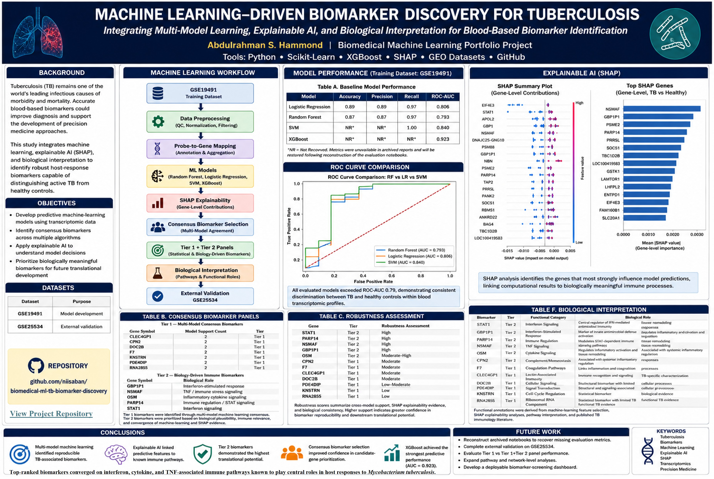
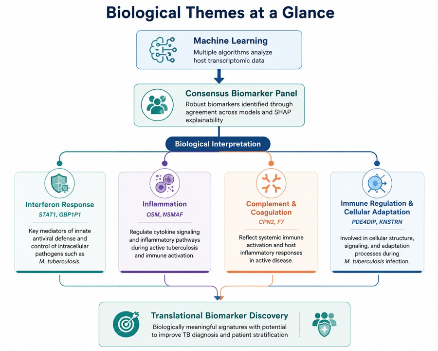
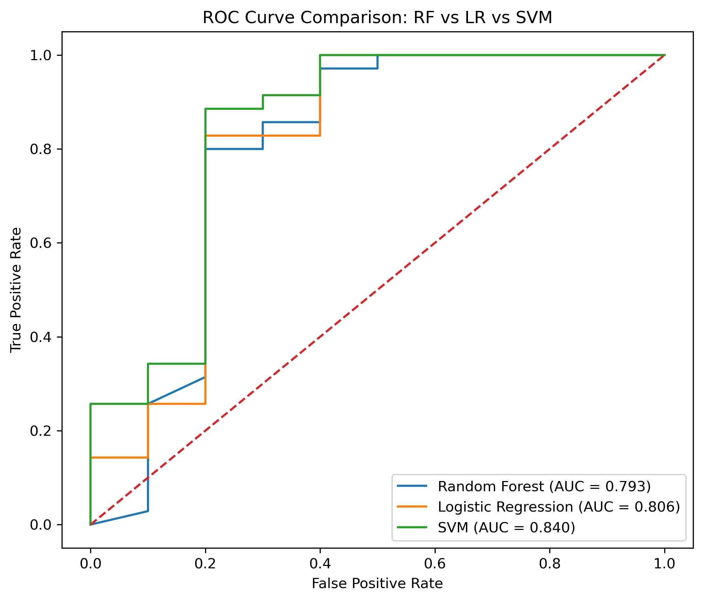
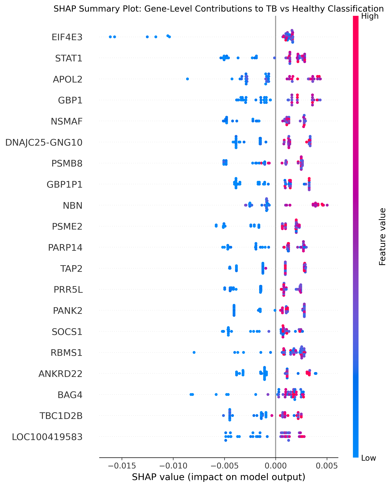

<p align="center">
  
</p>

<p align="center">
  <a href="#project-overview">Project Overview</a> •
  <a href="#machine-learning-workflow">Workflow</a> •
  <a href="#key-results">Key Results</a> •
  <a href="#consensus-biomarker-panel">Biomarkers</a> •
  <a href="#interactive-visualization-dashboard">Dashboard</a> •
  <a href="#scientific-poster">Poster</a> •
  <a href="#reproducibility-checklist">Reproducibility</a> •
  <a href="#project-resources">Resources</a>
</p>

## Project Overview

This repository accompanies our research on machine learning–driven discovery of blood-based transcriptional biomarkers for tuberculosis (TB) using publicly available human gene expression datasets.

The project integrates Random Forest, Logistic Regression, Support Vector Machine, XGBoost, SHAP explainability, consensus biomarker prioritization, biological interpretation, and external validation planning into a single reproducible workflow.

Beyond predictive performance, the study emphasizes biological interpretability, identifying host-response signatures that are statistically robust, biologically meaningful, and potentially translatable into future diagnostic applications.

This repository accompanies the research presented in the companion manuscript and provides the computational resources, figures, interactive visualizations, and reproducibility materials supporting the study.

---

## Companion to the Manuscript

This repository serves as the official public companion to the manuscript:

Machine Learning–Driven Biomarker Discovery for Tuberculosis Using Human Transcriptomic Data

The repository extends the manuscript by providing materials that cannot easily be presented within a traditional journal article, including:

* Interactive Tableau dashboard
* Scientific poster
* High-resolution workflow diagrams
* Complete figures
* Supporting tables
* Biological interpretation summaries
* Reproducibility documentation
* Project evolution and future work

Together, the manuscript and repository provide a transparent, reproducible, and extensible scientific record of the complete bimarker discovery workflow.

## Project Resources

| Resource | Description | Location |
|----------|-------------|----------|
| 📄 **Companion Manuscript** | Complete scientific manuscript | `/reports/` |
| 📊 **Interactive Dashboard** | Interactive Tableau visualization | Tableau Public |
| 🖼️ **Scientific Poster** | Conference-style project summary | `/reports/poster/` |
| 📈 **Figures** | Publication-quality graphics | `/results/figures/` |
| 📋 **Tables** | Performance metrics and biomarker tables | `/results/tables/` |
| 🔬 **Workflow** | End-to-end analytical workflow | `/docs/workflow.md` |
| 📁 **Reproducibility Resources** | Project documentation and supporting materials | Repository root |

## Repository Highlights

This repository goes beyond a traditional code repository by serving as a
comprehensive companion to the manuscript. It integrates computational
analysis, biological interpretation, interactive visualization, and
reproducibility resources into a single open-science platform.

- End-to-end machine learning workflow for tuberculosis biomarker discovery.
- Four complementary machine learning models with comparative evaluation.
- Consensus biomarker prioritization using multi-model agreement.
- Explainable AI (SHAP) for interpretable feature importance.
- Biological interpretation linking biomarkers to immune pathways.
- Independent external validation framework using GEO GSE25534.
- Interactive Tableau dashboard for exploratory analysis.
- Publication-quality figures, workflow diagrams, and scientific poster.
- Complete reproducibility resources accompanying the manuscript.

## Quick Repository Statistics
| Repository Metric           | Value                                                                                                 |
| --------------------------- | ----------------------------------------------------------------------------------------------------- |
| Disease Focus               | Tuberculosis (TB)                                                                                     |
| Training Dataset            | GEO GSE19491                                                                                          |
| External Validation Dataset | GEO GSE25534                                                                                          |
| Machine Learning Models     | Random Forest, Logistic Regression, Linear Support Vector Machine (Linear SVM), XGBoost                                               |
| Explainable AI              | SHAP                                                                                                  |
| Consensus Biomarker Panel   | Tier 1 + Tier 2 candidate genes                                                                       |
| Biological Themes           | Interferon signaling, inflammation, complement & coagulation, immune regulation & cellular adaptation |
| Interactive Dashboard       | Tableau Public                                                                                        |
| Scientific Poster           | Included                                                                                              |
| Companion Manuscript        | Included                                                                                              |
| Reproducibility Resources   | Included                                                                                              |
| Repository License          | MIT                                                                                                   |

## Technology Stack
| Category         | Technology            |
| ---------------- | --------------------- |
| Programming      | Python 3.11           |
| Machine Learning | Scikit-learn, XGBoost |
| Explainability   | SHAP                  |
| Data Source      | GEO                   |
| Visualization    | Tableau               |
| Version Control  | GitHub                |
| Documentation    | Markdown               |
| Repository Hosting  | GitHub                |

## Scientific Motivation

Tuberculosis remains one of the leading infectious causes of death worldwide. Early and accurate diagnosis is essential for disease control, yet conventional diagnostic approaches may be limited by sensitivity, infrastructure requirements, or turnaround time.

Host transcriptomic biomarkers provide an opportunity to identify disease-associated immune signatures directly from patient gene expression profiles. However, many machine learning studies emphasize predictive performance without sufficient biological interpretation or validation.

This project addresses that gap by integrating:

* Machine learning classification
* Consensus biomarker prioritization
* SHAP explainability
* Biological interpretation
* External validation planning

to identify biomarker candidates that are both statistically robust and biologically meaningful.

---

## Key Results at a Glance

| Category | Outcome |
|----------|-------------|
| **Disease Focus** | Human Tuberculosis (TB). |
| **Training Dataset** | GEO GSE19491. |
| **External Validation** | GEO GSE25534. |
| **Machine Learning Models** | Random Forest, Logistic Regression, Linear SVM, XGBoost.|
| **Explanability** | SHAP feature importance. |
| **Feature Selection** | Consensus multi-model biomarker prioritization. |
| **Biological Context** | Single-cell mapping and systems immunology. |
| **Deliverables** | Manuscript, dashboard, poster, workflow, reproducibility resources. |

## Performance Table

| Model | ROC-AUC | Mean Cross-Validation AUC |
|----------|-------------|----------|
| **Random Forest** | 0.793 |0.921  |
| **Logistic Regression** | 0.806 |0.943  |
| **Linear SVM** | 0.840 |0.955  |
| **XGBoost** | 0.923 |**To be reconstructed**  |

Consensus biomarkers were prioritized using agreement across multiple machine learning models together with SHAP explainability, resulting in biologically interpretable candidate signatures for tuberculosis diagnosis.

## Key Contributions

- Integrated four complementary machine learning algorithms for biomarker discovery.

- Prioritized biomarkers using consensus feature selection together with SHAP explainability.

- Combined transcriptomics with systems immunology for biological interpretation.

- Established an external validation framework using an independent GEO cohort.

- Developed a complete companion research repository supporting transparency and reproducibility.

## Objectives

The primary objectives of this project were to:

1. Develop machine learning models capable of distinguishing Active TB from Healthy Controls.
2. Identify candidate biomarkers using multiple feature selection approaches.
3. Evaluate model interpretability using SHAP explainability analysis.
4. Prioritize biologically relevant biomarker panels.
5. Assess biomarker robustness through consensus evaluation.
6. Establish an external validation workflow for independent dataset assessment.

---

## Dataset Description

### Discovery Dataset

**GSE19491**

* Platform: Illumina HumanHT-12 v3.0 Expression BeadChip
* Organism: Human
* Phenotypes:

  * Active Tuberculosis
  * Latent Tuberculosis
  * Healthy Controls

For Phase 1 analyses, the primary classification task focused on:

**Active TB vs Healthy Controls**

### External Validation Dataset

**GSE25534**

Used as an independent cohort for feature alignment, biomarker reproducibility assessment, and future model generalizability evaluation.

---

## Interactive Visualization Dashboard

An interactive Tableau dashboard summarizes machine learning performance,
consensus biomarker prioritization, SHAP explainability, biological
interpretation, and external validation results.

Unlike the static figures presented throughout this repository, the dashboard
allows readers to interactively explore model performance, biomarker rankings,
biological categories, SHAP feature importance, and candidate gene signatures.

**Launch the interactive dashboard:**
[Biomedical ML for TB Biomarker Discovery Dashboard](https://public.tableau.com/app/profile/abdulrahman.hammond/viz/ML-TB_project_dashboard_ver3_ash22Jun2026/Dashboard1)

The interactive dashboard complements the manuscript by providing an explorable interface for the complete analytical workflow and project results.


## Machine Learning Workflow


*Figure A. End-to-end machine learning workflow illustrating the analytical pipeline from transcriptomic preprocessing through biomarker discovery and biological interpretation.*

## Key Results

### Baseline Model Performance

| Model               | Accuracy | Precision | Recall | ROC-AUC |
| ------------------- | -------- | --------- | ------ | ------- |
| Logistic Regression | 0.89     | 0.89      | 0.97   | 0.806   |
| Random Forest       | 0.87     | 0.87      | 0.97   | 0.793   |
| SVM                 | NA       | NA        | 1.00   | 0.840   |
| XGBoost             | NA       | NA        | NA     | 0.923   |

### Major Findings

* All baseline models demonstrated strong discrimination between Active TB and Healthy Controls.
* Logistic Regression achieved the highest overall accuracy (0.89).
* SVM achieved the strongest cross-validation performance (Mean CV AUC = 0.955).
* XGBoost achieved the highest test ROC-AUC (0.923).
* Multiple models independently identified overlapping biomarker candidates, supporting biomarker robustness.

---

## Scientific Poster

A conference-style scientific poster summarizing the project's objectives, methodology, machine learning workflow, biomarker discovery, and biological interpretation is available below.

### Poster Preview



**Download high-resolution PDF:**

[TB Biomarker Discovery Poster (PDF)](reports/TB_Biomarker_Discovery_Poster.pdf)

The poster provides a concise visual summary of the complete biomarker discovery pipeline and complements the detailed documentation contained throughout this repository.


## Consensus Biomarker Panel

### Tier 2 – Biologically Prioritized Biomarkers

| Gene   | Biological Role                    |
| ------ | ---------------------------------- |
| GBP1P1 | Interferon-stimulated response     |
| NSMAF  | TNF / immune stress signaling      |
| OSM    | Inflammatory cytokine signaling    |
| PARP14 | Immune regulation / STAT signaling |
| STAT1  | Interferon signaling               |

### Tier 1 – Multi-Model Consensus Biomarkers

* CLEC4GP1
* CPN2
* DOC2B
* F7
* KNSTRN
* PDE4DIP
* RNA28S5

### Final Consensus Biomarker Panel

The final reduced biomarker panel consisted of 12 candidate genes combining consensus machine learning support and biological relevance.

---

## Biological Significance
### Why These Biomarkers Matter?

Machine learning can identify genes that distinguish disease states with high predictive performance, but clinical translation requires more than statistical accuracy. This project therefore combined machine learning, SHAP explainability, consensus feature selection, and biological interpretation to prioritize biomarkers supported by both computational evidence and established immunological mechanisms.

The final consensus biomarker panel reflects multiple aspects of the host immune response to *Mycobacterium tuberculosis*, including interferon signaling, inflammatory regulation, complement activation, and cellular adaptation during active disease. Rather than relying on a single algorithm, biomarkers were selected through agreement across complementary machine learning models, increasing confidence that the identified signatures represent robust biological phenomena rather than model-specific artifacts.

## Biological Interpretation of Representative Biomarkers
|Biological Theme | Representative Biomarkers | Biological Relevance |
|----------|-------------|----------|
| **Interferon Signaling** | STAT1, GBP1P1 |Central mediators of host defense against intracellular pathogens and consistently associated with active tuberculosis.  |
| **Inflammatory Regulation** | OSM, NSMAF |Participate in cytokine signaling and regulation of inflammatory responses during infection.  |
| **Complement & Coagulation** | CPN2, F7 |Reflect systemic immune activation and host inflammatory responses accompanying active disease.  |
| **Cellular Structure & Signaling** | PDE4DIP, KNSTRN |Represent cellular organization, signaling pathways, and host adaptation to infection.  |
| **Consensus Biomarker Panel** | Tier 1 + Tier 2 genes |Selected through agreement across multiple machine learning algorithms together with SHAP explainability to maximize robustness and biological interpretability.  |

### From Prediction to Biological Insight
Unlike many machine learning studies that focus primarily on classification accuracy, this project emphasizes biological interpretability as an essential component of biomarker discovery. Explainable Artificial Intelligence (XAI) using SHAP was incorporated to identify genes that consistently contributed to model predictions, while consensus feature selection reduced dependence on any single algorithm.

The resulting workflow bridges computational modeling with systems immunology, providing candidate biomarkers that are not only predictive of active tuberculosis but also biologically meaningful and suitable for future experimental validation and translational research.

<p align="center">
  
</p>

*Figure 5. **Biological Themes at a Glance.** Machine learning–derived consensus biomarkers were organized into four major biological themes—including interferon signaling, inflammatory regulation, complement/coagulation, and cellular adaptation—illustrating how computational feature selection converges with biological interpretation to identify translational biomarker candidates.*

## Explainability Analysis

Model interpretability was assessed using SHAP (SHapley Additive exPlanations).

SHAP analysis identified multiple immune-associated genes among the strongest contributors to model predictions and provided quantitative evidence supporting biomarker prioritization.

### ROC Curve Comparison


*Figure 1. Receiver Operating Characteristic (ROC) curve comparison of Random Forest (RF), Logistic Regression (LR), and Support Vector Machine (SVM) models for Active TB versus Healthy Control classification. All models demonstrated strong discriminatory performance, with SVM achieving the highest ROC-AUC.*

### Cross-Validation Comparison
- [Figure 2: Cross-Validation Comparison](results/figures/Figure_2_CrossValidationComparison.png)

*Figure 2. Stratified 5-fold cross-validation performance across machine learning models. SVM demonstrated the strongest mean validation performance, supporting model robustness and generalizability.*

### SHAP Summary Plot


*Figure 3. SHAP summary plot showing gene-level contributions to Active TB versus Healthy Control classification. STAT1, GBP1P1, PARP14, NSMAF, and other immune-associated genes contributed strongly to model predictions.*

### SHAP Feature Importance Plot 
- [Figure 4: SHAP Feature Importance Plot](results/figures/Figure_4_SHAP_Barplot.png)

*Figure 4. SHAP feature importance ranking of candidate biomarkers. Genes with larger mean absolute SHAP values exerted greater influence on model predictions and were prioritized for downstream biological interpretation.*

## Biological Insights

Biological interpretation revealed strong enrichment for:

* Interferon-mediated immune responses
* TNF-associated inflammatory signaling
* Cytokine-mediated immune regulation
* Host-defense and antimicrobial pathways

STAT1 emerged as a particularly compelling biomarker due to its central role in interferon-responsive transcriptional programs. Additional candidates including GBP1P1, PARP14, NSMAF, and OSM demonstrated convergence of machine learning support, SHAP importance, and biological plausibility.

Together, these findings suggest that active tuberculosis is characterized by coordinated activation of interferon and inflammatory signaling pathways that can be detected through host transcriptional signatures.

---

## External Validation

Independent validation was initiated using GSE25534.

Completed activities include:

* External dataset selection
* Phenotype label generation
* External biomarker panel creation
* Feature alignment
* Platform compatibility verification

Final validation modeling and performance metrics remain pending reconstruction following notebook loss caused by a power interruption. The validation workflow will be rerun to restore quantitative performance estimates and complete the model generalizability assessment.

---

## Supporting Tables

The project generated multiple structured result tables summarizing model performance,
biomarker prioritization, explainability analysis, robustness assessment, biological
interpretation, and external validation workflow status.

The tables below provide direct access to the primary quantitative outputs of the study.
...
| Table                                                                                         | Description                                                                                  |
| --------------------------------------------------------------------------------------------- | -------------------------------------------------------------------------------------------- |
| [Table A – Baseline Model Performance](results/tables/Table_A_Phase_1_BaselinePerformance.jpg) | Classification performance metrics for Logistic Regression, Random Forest, SVM, and XGBoost. |
| [Table B – Consensus Biomarker Panels](results/tables/Table_B_Phase_1_TierPanels.jpg)          | Tier 1 and Tier 2 biomarker candidates identified through multi-model consensus.             |
| [Table C – Robustness Assessment](results/tables/Table_C_Phase_1_RobustnessAssessment.jpg)     | Cross-model support and robustness evaluation of candidate biomarkers.                       |
| [Table D – External Validation Workflow](results/tables/Table_D_ExternalValidation.jpg)       | Status of external validation activities using GSE25534.                                     |
| [Table E – SHAP Top Features](results/tables/Table_E_SHAP_TopFeatures.jpg)                    | Highest-ranked biomarkers identified through SHAP explainability analysis.                   |
| [Table F – Biological Interpretation](results/tables/Table_F_BiologicalInterpretation.jpg)    | Functional categorization and biological roles of prioritized biomarker candidates.          |

## Repository Structure

The repository is organized to separate datasets, analytical workflows, figures, reproducibility resources, and publication materials into a clear and maintainable structure.

### Repository Tree
```text
biomedical-ml-tb-biomarker-discovery/
│
├── assets/
│   ├── figures/              # Publication-quality figures
│   ├── images/               # README graphics and illustrations
│   ├── posters/              # Scientific poster
│   └── workflow/             # Workflow diagrams
│
├── data/                     # Processed datasets and metadata
│
├── docs/                     # Supplementary documentation
│
├── notebooks/                # Jupyter notebooks
│
├── reports/                  # Manuscript and supporting reports
│
├── results/                  # Model outputs and evaluation results
│
├── src/                      # Python source code
│
├── LICENSE                   # MIT License
├── README.md                 # Repository landing page
└── CITATION.cff              # Citation metadata
```

### Directory Overview

| Directory    | Purpose                                                            |
| ------------ | ------------------------------------------------------------------ |
| `assets/`    | Figures, README graphics, workflow diagrams, and scientific poster |
| `data/`      | Processed datasets, metadata, and supporting data files            |
| `docs/`      | Supplementary documentation and reference materials                |
| `notebooks/` | Jupyter notebooks for exploratory analysis and model development   |
| `reports/`   | Manuscript and supporting reports                                  |
| `results/`   | Model outputs, evaluation metrics, and analytical results          |
| `src/`       | Python source code implementing the machine learning workflow      |

## Key Repository Documents
The following resources provide the primary entry points for understanding, reproducing, and extending this work. Together they document the study, analytical workflow, computational resources, and supporting materials accompanying this repository.

### Primary Resources
| Resource                      | Purpose                   |
| ----------------------------- | ------------------------- |
| README.md                     | Complete repository overview and navigation      |
| Companion Manuscript          | Complete companion manuscript describing the study |
| Scientific Poster             | Visual summary            |
| Interactive Tableau Dashboard | Interactive exploration of models, biomarkers, and biological interpretation   |

### Supporting Resources
| Resource | Purpose |
|-----------|-------------|
| [Project Scope](docs/project_scope.md) | Project objectives, research questions, analytical strategy, and study scope. |
| [Workflow Documentation](docs/workflow.md) | End-to-end machine learning workflow including preprocessing, modeling, explainability, and validation steps. |
| [Data Sources](docs/data_sources.md) | Description of discovery and validation datasets, platform information, and data provenance. |
| [Reproducibility Resources/Results Summary](docs/results_summary.md) | Notebooks and Code. Consolidated summary of model performance, biomarker prioritization, biological interpretation, and validation activities. |
| CITATION.cff              | Citation metadata    |
| LICENSE                   | MIT License          |


## Reproducibility Checklist
This repository has been organized to maximize transparency, reproducibility, and long-term reuse.
| ✓ | Resource                                           |
| - | -------------------------------------------------- |
| ✓ | Public discovery dataset (GSE19491)                |
| ✓ | Independent external validation dataset (GSE25534) |
| ✓ | End-to-end machine learning workflow               |
| ✓ | Consensus biomarker prioritization                 |
| ✓ | Explainable AI (SHAP) analysis                     |
| ✓ | Biological interpretation                          |
| ✓ | Interactive Tableau dashboard                      |
| ✓ | Scientific poster                                  |
| ✓ | Companion manuscript                               |
| ✓ | Repository documentation                           |
| ✓ | Version-controlled GitHub repository               |
| ✓ | Citation metadata (CITATION.cff)                   |
| ✓ | MIT License                                        |

Together, these resources provide a transparent, reusable, and reproducible framework for machine learning–driven biomarker discovery.


## Future Work

This repository documents the Phase 1 machine learning workflow for tuberculosis biomarker discovery and serves as the foundation for ongoing model refinement and biological validation.

This repository will continue to evolve alongside the companion manuscript. Planned future developments include:

* Reconstruct archived evaluation notebooks following data loss caused by a power interruption, restoring missing SVM and XGBoost performance metrics.
* Complete external validation using the independent GSE25534 transcriptomic cohort and report quantitative validation metrics.
* Evaluate additional publicly available tuberculosis transcriptomic datasets to assess model generalizability.
* Expand pathway enrichment, gene network analysis, and systems-level interpretation of prioritized biomarkers.
* Investigate reduced biomarker panels suitable for translational and clinically deployable diagnostic assays.
* Integrate subsequent systems-immunology analyses developed from this project into future repository releases.

These activities will further strengthen the reproducibility, robustness, and translational relevance of the identified tuberculosis biomarker candidates.


## Citation
If this repository, workflow, figures, dashboard, or companion manuscript contributes to your research, teaching, or derivative work, please cite:

**Hammond AS.** *Machine Learning–Driven Biomarker Discovery for Tuberculosis Using Human Transcriptomic Data. GitHub Repository, 2026.*

For citation metadata, see CITATION.cff.

Please also cite the original Gene Expression Omnibus (GEO) datasets and their associated publications used in this study.


## License

This repository is released under the MIT License, permitting reuse, modification, and redistribution with attribution.

See the LICENSE file for the complete license text.


## Author

**Abdulrahman S. Hammond**

Biomedical Scientist • Immunologist • Tuberculosis Research • Machine Learning • Biomarker Discovery

This repository accompanies ongoing research focused on explainable machine learning, transcriptomics, and biomarker discovery for infectious diseases.

Project status: **Active Development**


## Acknowledgments

This work builds upon publicly available Gene Expression Omnibus (GEO) datasets and open-source scientific software. The author gratefully acknowledges the biomedical research community and the developers of open-source tools that enabled this work.
