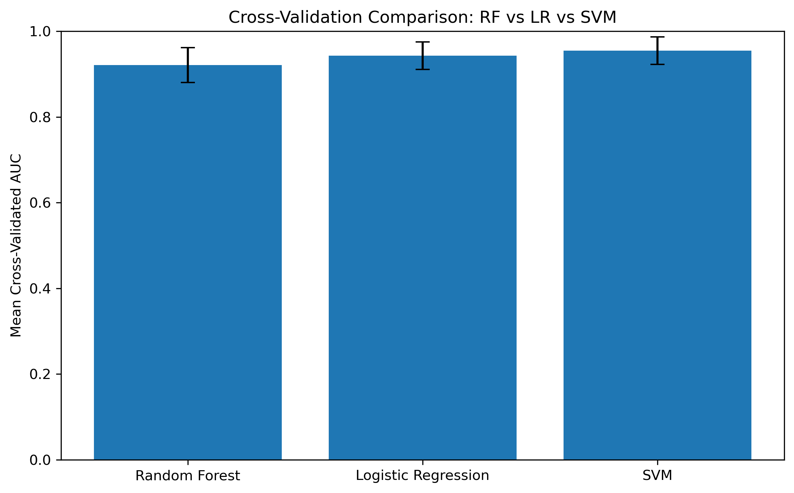
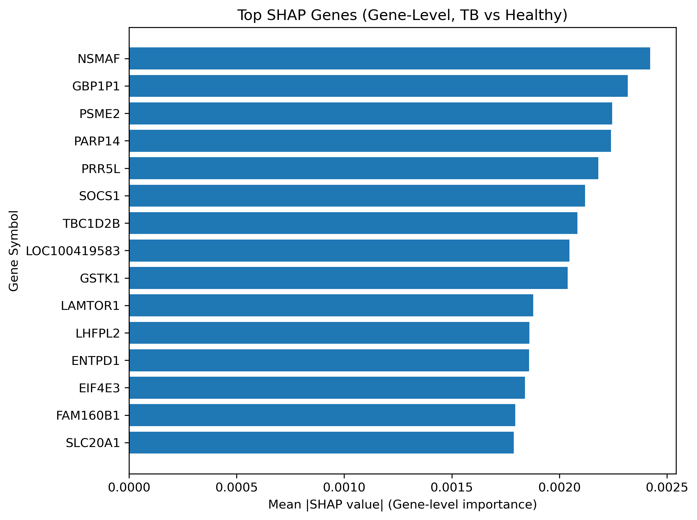

# Results Summary

## Baseline Machine Learning Performance

| Model | Accuracy | Precision | Recall | ROC-AUC | Mean CV AUC |
|-------|---------:|----------:|-------:|--------:|------------:|
| Logistic Regression | 0.89 | 0.89 | 0.97 | 0.806 | 0.943 |
| Random Forest | 0.87 | 0.87 | 0.97 | 0.793 | 0.921 |
| SVM | NA | NA | 1.00 | 0.840 | 0.955 |
| XGBoost | NA | NA | NA | 0.923 | NA |
#### *Performance metrics from the baseline Active TB versus Healthy Control classification task. Results provide the foundation for subsequent biomarker prioritization, robustness assessment, and biological interpretation.*

### Key Findings

- All baseline models demonstrated strong discrimination between Active TB and Healthy Controls.
- Logistic Regression achieved the highest overall accuracy (0.89).
- SVM achieved the highest cross-validation performance (Mean CV AUC = 0.955).
- XGBoost achieved the highest test ROC-AUC (0.923).
- Multiple models independently identified overlapping biomarker candidates, supporting biological robustness.

### Associated Figures

#### Figure 1. ROC Curve Comparison

*Comparison of Random Forest, Logistic Regression, and SVM ROC performance for Active TB versus Healthy Controls.*

#### Figure 2. Cross-Validation Comparison

*Mean cross-validation AUC comparison across Random Forest, Logistic Regression, and SVM models.*

## Biomarker Candidate Identification

Consensus biomarker candidates were identified through feature selection across multiple machine learning models. Genes were organized into Tier 1 and Tier 2 panels based on statistical support and biological relevance.

### Tier 1 – Multi-Model Consensus Biomarkers

| Gene Symbol | Model Support Count | Tier |
|-------------|--------------------|------|
| CLEC4GP1 | 2 | Tier 1 |
| CPN2 | 2 | Tier 1 |
| DOC2B | 2 | Tier 1 |
| F7 | 2 | Tier 1 |
| KNSTRN | 2 | Tier 1 |
| PDE4DIP | 2 | Tier 1 |
| RNA28S5 | 2 | Tier 1 |

### Tier 2 – Biology-Driven Immune Biomarkers

| Gene Symbol | Biological Role |
|-------------|-----------------|
| GBP1P1 | Interferon-stimulated response |
| NSMAF | TNF / immune stress signaling |
| OSM | Inflammatory cytokine signaling |
| PARP14 | Immune regulation / STAT signaling |
| STAT1 | Interferon signaling |

### Combined Reduced Panel

The final reduced biomarker panel combined Tier 1 consensus biomarkers with Tier 2 biology-driven immune biomarkers, resulting in a 12-gene candidate signature for downstream evaluation.

| Tier 1 | Tier 2 |
|---------|---------|
| CLEC4GP1 | GBP1P1 |
| CPN2 | NSMAF |
| DOC2B | OSM |
| F7 | PARP14 |
| KNSTRN | STAT1 |
| PDE4DIP | |
| RNA28S5 | |

**Total genes:** 12

## Biomarker Robustness Assessment

Candidate biomarkers were assessed using machine learning support, SHAP explainability analysis, pathway enrichment, and biological interpretation.

| Gene | Tier | Assessment |
|------|------|------------|
| STAT1 | Tier 2 | High |
| PARP14 | Tier 2 | High |
| NSMAF | Tier 2 | High |
| GBP1P1 | Tier 2 | High |
| OSM | Tier 2 | Moderate–High |
| CPN2 | Tier 1 | Moderate |
| F7 | Tier 1 | Moderate |
| CLEC4GP1 | Tier 1 | Moderate |
| DOC2B | Tier 1 | Moderate |
| PDE4DIP | Tier 1 | Low–Moderate |
| KNSTRN | Tier 1 | Low |
| RNA28S5 | Tier 1 | Low |

### Key Observation

The robustness framework later used in the manuscript emerged directly from these analyses. Biomarkers such as STAT1, PARP14, NSMAF, CPN2, DOC2B, and F7 demonstrated consistent support across feature selection, model explainability, and biological interpretation, whereas KNSTRN, RNA28S5, and PDE4DIP remained primarily statistical candidates with limited biological evidence.

### Associated Figures

#### Figure 3. SHAP Summary Plot

*SHAP summary plot showing gene-level contributions to Active TB versus Healthy Control classification. Positive SHAP values increase prediction toward Active TB, whereas negative values contribute toward Healthy classification.*

#### Figure 4. SHAP Feature Importance

*Top gene-level biomarkers ranked by mean absolute SHAP value. Higher values indicate greater contribution to model prediction and biomarker prioritization.*

## Biological Interpretation

Detailed pathway enrichment, interferon signaling, inflammatory cytokine responses, and systems-immunology findings will be added in a future repository update.
(To be expanded in a future update.)

## External Validation
Independent external validation was performed using GSE25534 to evaluate biomarker reproducibility, feature alignment, and model generalizability across datasets.

